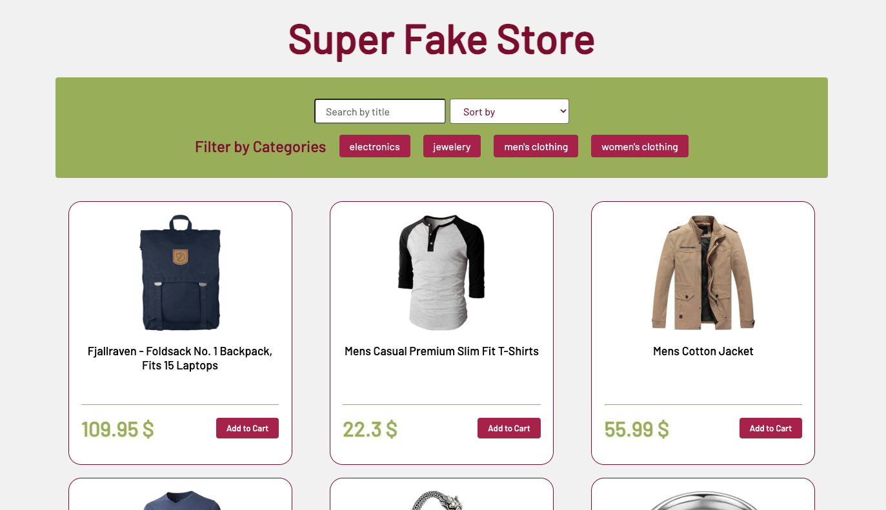
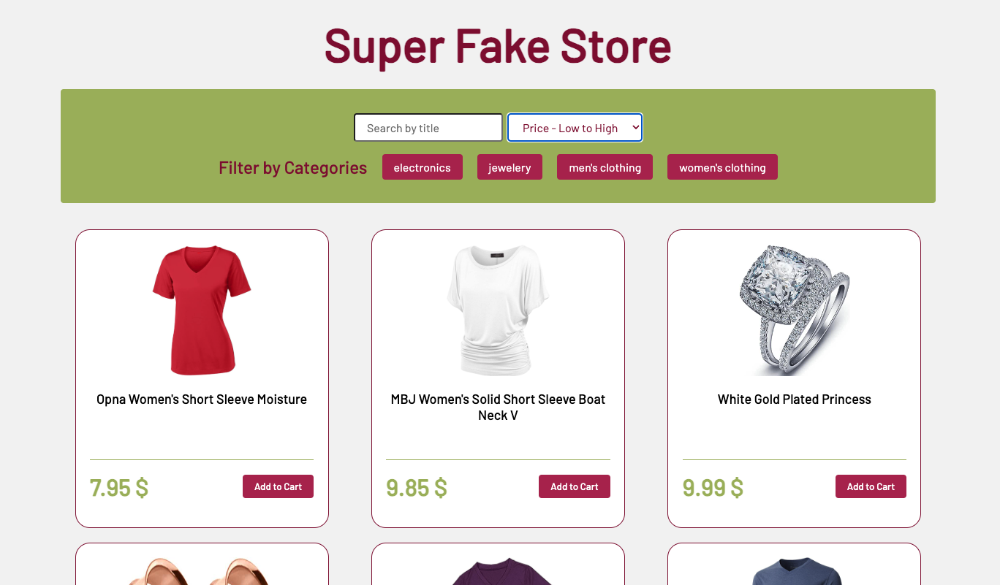
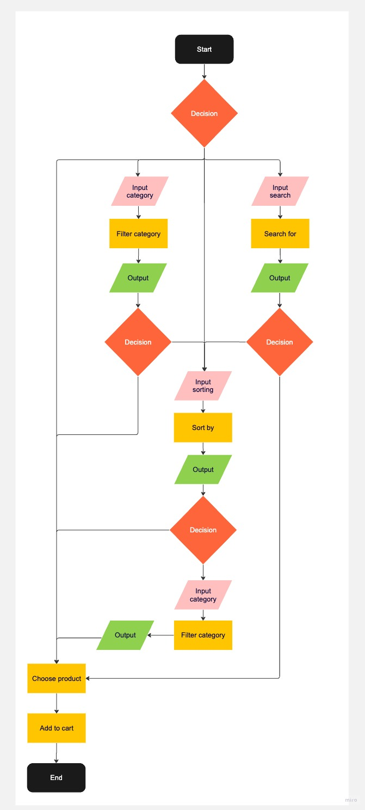

# Super Fake Store

- This project was created as part of a coding bootcamp.
- I mainly worked with the array methods filter(), forEach(), and sort()
- the learning objective of this project:
- learning how to use fetch and APIs
- how to sort and filter them
- creating dynamic Elements with JS
- clean and dynamic code

## Demo

https://cecilestaller.github.io/js-API-FakeStore-Project/

## Screenshots

## Tech Stack

- HTML5
- SCSS
- JavaScript
- RESTful API
- miro/ PAP

## Link to API

https://fakestoreapi.com/products

## Authors

- [@cecilestaller](https://github.com/cecilestaller)
